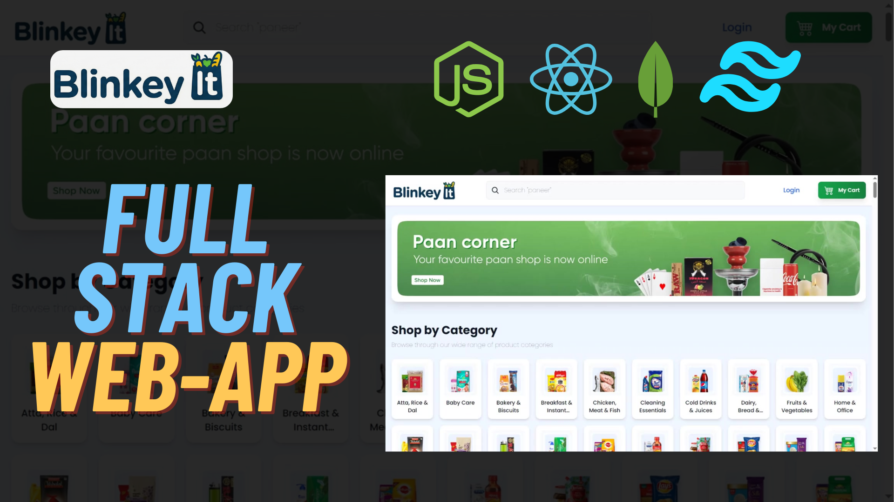

# 🛒 Blinkey It - Quick-Commerce App

A modern, full-stack quick-commerce application built with React, Node.js, Express, and MongoDB. Features include user authentication, product management, shopping cart, order processing, and Stripe payment integration.




## ✨ Features

- 🔐 **User Authentication** - Register, login, forgot password with JWT
- 🛍️ **Product Catalog** - Browse products by categories and subcategories
- 🔍 **Search Functionality** - Find products with real-time search
- 🛒 **Shopping Cart** - Add, update, and remove items
- 💳 **Payment Integration** - Secure checkout with Stripe
- 📦 **Order Management** - Track your orders
- 👤 **User Profile** - Manage account details and addresses
- 📱 **Responsive Design** - Works on desktop, tablet, and mobile
- 👨‍💼 **Admin Panel** - Manage products, categories, and orders

## 🚀 Tech Stack

### Frontend
- **React 18** - UI library
- **Redux Toolkit** - State management
- **React Router** - Navigation
- **Tailwind CSS** - Styling
- **Axios** - HTTP client
- **React Hot Toast** - Notifications
- **Vite** - Build tool

### Backend
- **Node.js** - Runtime environment
- **Express.js** - Web framework
- **MongoDB** - Database
- **Mongoose** - ODM
- **JWT** - Authentication
- **bcrypt** - Password hashing
- **Stripe** - Payment processing
- **Cloudinary** - Image hosting
- **Resend** - Email service

## 📋 Prerequisites

Before running this project, make sure you have:

- **Node.js** (v18 or higher) - [Download](https://nodejs.org/)
- **MongoDB** - [MongoDB Atlas](https://www.mongodb.com/cloud/atlas) account (free tier)
- **Cloudinary** account - [Sign up](https://cloudinary.com/)
- **Stripe** account - [Sign up](https://stripe.com/)
- **Resend** account - [Sign up](https://resend.com/)

## 🛠️ Installation & Setup

### 1. Clone the Repository

```bash
git clone https://github.com/yourusername/blinkey-it.git
cd blinkey-it
```

### 2. Backend Setup

```bash
# Navigate to server directory
cd server

# Install dependencies
npm install

# Create .env file
cp .env.example .env
```

#### Configure server/.env file:

```env
PORT=8080
NODE_ENV=development

# MongoDB - Get from MongoDB Atlas
MONGODB_URI=your_mongodb_connection_string

# JWT Secrets - Generate random strings
JWT_SECRET_KEY=your_random_jwt_secret_key
JWT_REFRESH_SECRET_KEY=your_random_refresh_secret_key

# Frontend URL
FRONTEND_URL=http://localhost:5173

# Cloudinary - Get from Cloudinary dashboard
CLOUDINARY_CLOUD_NAME=your_cloud_name
CLOUDINARY_API_KEY=your_api_key
CLOUDINARY_API_SECRET=your_api_secret

# Resend API - Get from Resend dashboard
RESEND_API=your_resend_api_key

# Stripe - Get from Stripe dashboard (test mode)
STRIPE_SECRET_KEY=your_stripe_secret_key
```

### 3. Frontend Setup

```bash
# Navigate to client directory (from project root)
cd client

# Install dependencies
npm install

# Create .env file
cp .env.example .env
```

#### Configure client/.env file:

```env
VITE_API_URL=http://localhost:8080
VITE_STRIPE_PUBLIC_KEY=your_stripe_publishable_key
```

### 4. Run the Application

#### Start Backend Server:
```bash
# From server directory
npm run dev
```
Server will run on `http://localhost:8080`

#### Start Frontend (in a new terminal):
```bash
# From client directory
npm run dev
```
Frontend will run on `http://localhost:5173`

### 5. Access the Application

Open your browser and go to: **http://localhost:5173**

## 📚 Project Structure

```
blinkey-it/
├── client/                 # Frontend React application
│   ├── src/
│   │   ├── components/    # Reusable UI components
│   │   ├── pages/         # Page components
│   │   ├── layouts/       # Layout components
│   │   ├── store/         # Redux store and slices
│   │   ├── utils/         # Utility functions
│   │   ├── hooks/         # Custom React hooks
│   │   └── assets/        # Images and static files
│   └── package.json
│
├── server/                # Backend Node.js application
│   ├── controllers/       # Request handlers
│   ├── models/           # Mongoose schemas
│   ├── routes/           # API routes
│   ├── middleware/       # Custom middleware
│   ├── config/           # Configuration files
│   └── utils/            # Utility functions
│
└── README.md
```

## 🔑 Environment Variables Explanation

### Server Environment Variables:

- `MONGODB_URI` - MongoDB connection string from MongoDB Atlas
- `JWT_SECRET_KEY` - Secret key for access tokens (generate a random 64-character string)
- `JWT_REFRESH_SECRET_KEY` - Secret key for refresh tokens
- `CLOUDINARY_*` - Credentials from Cloudinary for image uploads
- `RESEND_API` - API key from Resend for sending emails
- `STRIPE_SECRET_KEY` - Secret key from Stripe dashboard

### Client Environment Variables:

- `VITE_API_URL` - Backend API URL
- `VITE_STRIPE_PUBLIC_KEY` - Publishable key from Stripe dashboard

## 🐳 Docker & nginx Files (Optional)

- **docker-compose.yml** - For containerized deployment (production)
- **Dockerfile** - Docker image configuration
- **nginx.conf** - Web server configuration for production

These files are NOT needed for local development. They're included for production deployment.

## 🎯 Usage

### As an Admin:
1. Login with admin credentials
2. Access Admin Panel
3. Manage categories, subcategories, and products
4. Upload product images
5. View and manage orders


### As a User:
1. Register a new account
2. Browse products by category
3. Add items to cart
4. Proceed to checkout
5. Complete payment with test card: `4242 4242 4242 4242`
6. View your orders in the dashboard

## Notes

- Never commit `.env` files to GitHub
- Keep your API keys and secrets secure
- Use environment variables for all sensitive data
- The `.gitignore` is configured to exclude sensitive files

## 🤝 Contributing

1. Fork the repository
2. Create a feature branch (`git checkout -b feature/AmazingFeature`)
3. Commit your changes (`git commit -m 'Add some AmazingFeature'`)
4. Push to the branch (`git push origin feature/AmazingFeature`)
5. Open a Pull Request

## 📄 License

This project is licensed under the MIT License.

## Support

For support, or create an issue in the repository.

## Acknowledgments

- Images hosted on Cloudinary
- Payment processing by Stripe
- Email service by Resend
- UI components built with Tailwind CSS

---

Inspired by - Youtube : Dynamic Coding with Amit
